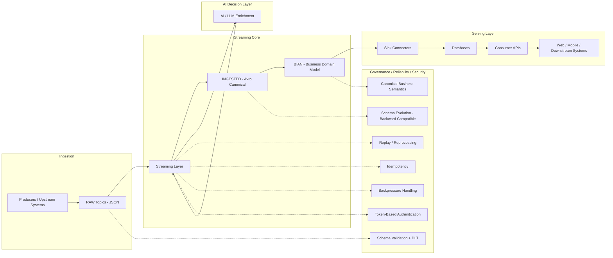

## Hi, I'm Renato Viana 👋

**Principal Software Engineer | Event-Driven Architect | AI Infrastructure**

📍 Ottawa, Canada  
🔗 [LinkedIn](https://linkedin.com/in/renatoviana) | [Website](https://renatosviana.github.io/)

---

## 🚀 About Me

I design and build **high-throughput, event-driven platforms at scale**, powering real-time decision systems in regulated environments.

At PNC Bank (via CGI), I led the architecture and delivery of a **Kafka-based streaming platform processing 100M+ events/day**, supporting **35M+ customers** across enterprise banking systems.

My focus is at the intersection of:
- **Event Streaming (Kafka / Redpanda)**
- **Distributed Systems Architecture**
- **AI Infrastructure & Inference Pipelines**

I specialize in building systems that are:
- **Deterministic & replayable**
- **Auditable & compliant**
- **Designed for real-world AI integration**

---

## 🧩 Reference Architecture — Governed Event-Driven AI Platform

---

## 🧠 What I’m Building

- **Agentic Kafka Architectures**  
  → Designing AI systems on top of streaming platforms with clear separation of:
  **facts → decisions → actions**

- **Real-Time AI Pipelines**  
  → Kafka + Avro + Spring Boot + vector search + LLM integration

- **Algorithm & System Design Mastery**  
  → Strengthening fundamentals for large-scale system design

---

## 🏗️ Core Architecture Expertise

- Event-driven microservices (Spring Boot)
- Kafka streaming pipelines (RAW → INGESTED → BIAN → DB → APIs)
- Schema governance & evolution (Avro, compatibility strategies)
- High-availability systems (active-active, multi-region)
- CI/CD & containerization (Jenkins, Docker, OpenShift)

---

## ⚙️ Tech Stack

**Languages:** Java (primary), Python  
**Streaming:** Kafka, Redpanda  
**Cloud & Infra:** OpenShift, Kubernetes, Docker  
**Data:** Avro, SQL (Oracle, SQL Server), MongoDB  
**Frameworks:** Spring Boot, Microservices  
**AI:** LLM APIs, Vector Search, GenAI integration  

---

## 📌 Featured Projects

### 🔹 [agentic-kafka-reference-architecture](https://github.com/renatosviana/agentic-kafka-reference-architecture)
**Reference architecture for AI systems on event streams**

- Deterministic and replayable AI pipelines
- Separation of concerns: facts vs decisions vs actions
- Designed for regulated environments

---

### 🔹 [kafka-avro-genai-streaming-app](https://github.com/renatosviana/kafka-avro-genai-streaming-app)
**Real-time streaming pipeline with AI enrichment**

- Kafka + Avro + Spring Boot
- AI-based classification and enrichment
- Production-style event flow design

---

### 🔹 [algorithms-study-java](https://github.com/renatosviana/algorithms-study-java)
**Structured practice of data structures & algorithms**

- Focus on patterns used in real systems
- Reinforcing problem-solving fundamentals

---

## 🤝 Let’s Connect

- 📧 renatosviana@gmail.com  
- 💼 [LinkedIn](https://linkedin.com/in/renatoviana)

---

> I’m particularly interested in roles focused on **event streaming platforms, AI infrastructure, and large-scale distributed systems architecture**.
